# CUDA Path Tracer

  
_The Sea of Flowers in Memory_

**University of Pennsylvania, CIS 565: GPU Programming and Architecture, Project 3**

-   Yu Jiang
    -   [LinkedIn](https://www.linkedin.com/in/yu-jiang-450815328/)
-   Tested on: Windows 11, Ultra 7 155H @ 3.80 GHz, 32GB RAM, RTX 4060 8192MB (Personal Laptop)

## Summary

-   [Final Scene Project Overview](#final-scene-project-overview)
-   [Visual Features](#visual-features)
    -   [Anti-Aliasing](#anti-aliasing)
    -   [Perfect Specular Reflective & Refractive Material](#perfect-specular-reflective--refractive-material)
    -   [Disney BSDF](#disney-bsdf)
    -   [Texture & Normal Mapping with Arbitrary Mesh Loading](#texture-mapping--normal-mapping)
    -   [Multiple Importance Sampling](#multiple-importance-sampling)
    -   [Depth of Field with Auto Focus](#depth-of-field)
    -   [Post-Processing](#post-processing)
    -   [Environment Mapping](#environment-mapping)
    -   [Open Image AI Denoiser](#open-image-ai-denoiser)
    -   [Stylized Rendering](#stylized-rendering---cel-shading)
        -   [Cel-Shading](#stylized-rendering---cel-shading)
        -   [Shadow Channel](#stylized-rendering---shadow-channel)
        -   [Line Rendering](#stylized-rendering---line-rendering)
        -   [Possible Future Work](#stylized-rendering---future-work)
-   [Performance Features](#features)
    -   [Ray Compaction](#ray-compaction)
    -   [Material Sort](#material-sort)
    -   [Ruaaian Roulette](#russian-roulette)
    -   [Bounding Volume Hierarchies with SAH Optimization](#bounding-volume-hierarchies)
-   [Compilation Changes](#compilation-changes)
-   [Bloopers](#bloopers)
-   [References](#references)

## Final Scene Project Overview

_The Sea of Flowers in Memory_ is composed of two parts, the scene and the character. The character is _Castorice_ from _Honkai Star Rail_, downloaded at APlaybox from miHoYo official account. The scene is originally created by _Wis_ at APlaybox and then modified by myself to fit the project. All the relative things includes skining, poses, materials, textures, geometry nodes, and render settings. The scene project file and textures project are following:

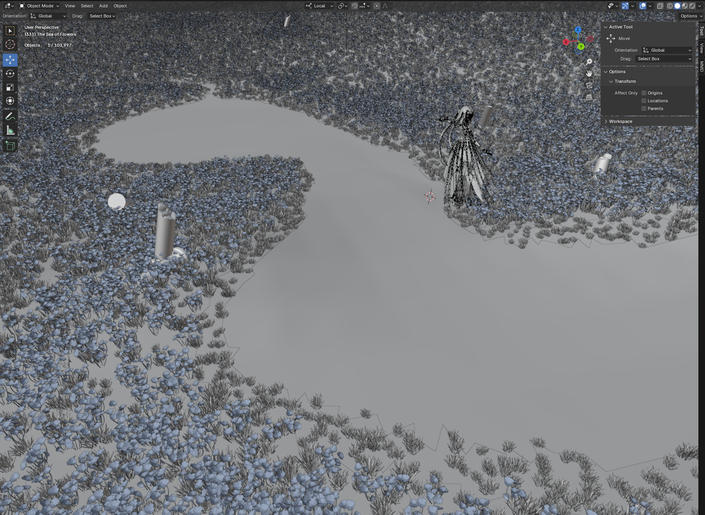  
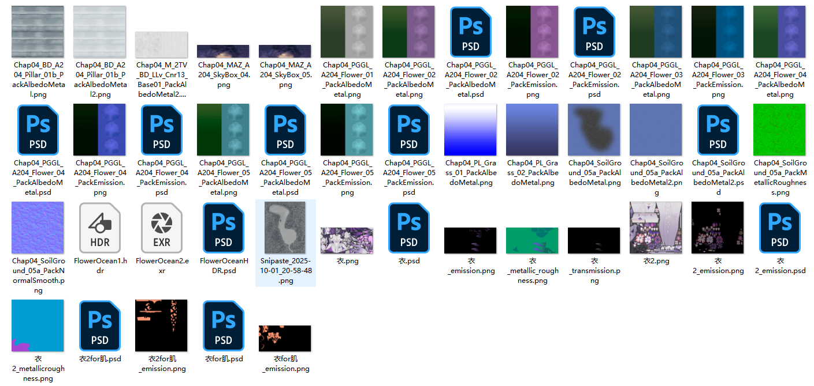

The scene used to render the header image is exported with this blender project, and the HDRI environment map is also rendered using this project in Blender.

The Whole Scene includes 12,577,487 primitives, the header image is rendered at 3840\*2160 resolution, 20 max trace depth, 5000 iterations and used OIDN denoise. For performance, this scene is rendered at about 0.6-0.7 fps.

## Visual Features

### Anti-Aliasing

#### Implementation

If the AA is enabled, jitter the ray on the screen within the (-0.5, 0.5) range, instead of always at the center of the pixel. So when samples increase, there will be rays shooting to different places within one pixel, so we will get soft edges.

#### Results

Here are the results of using anti-aliasing and not useing it, I also include two scaled images to better show the difference.

|                     With AA                     |                      W/O AA                       |
| :---------------------------------------------: | :-----------------------------------------------: |
|    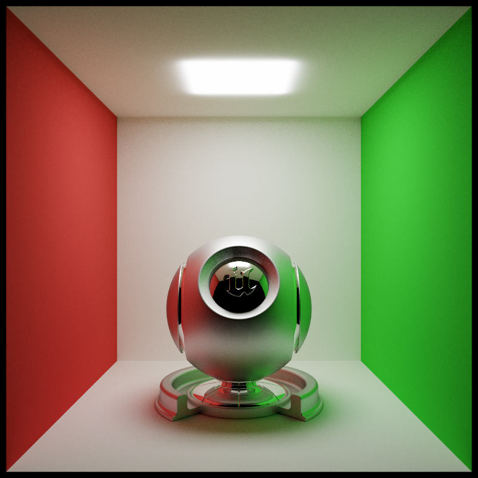     |         |
| 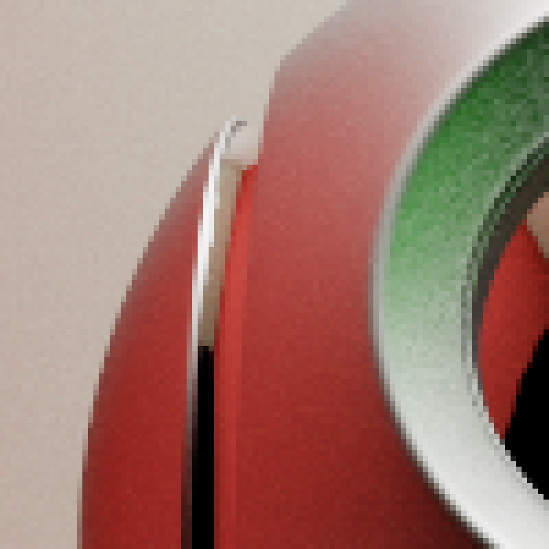 | 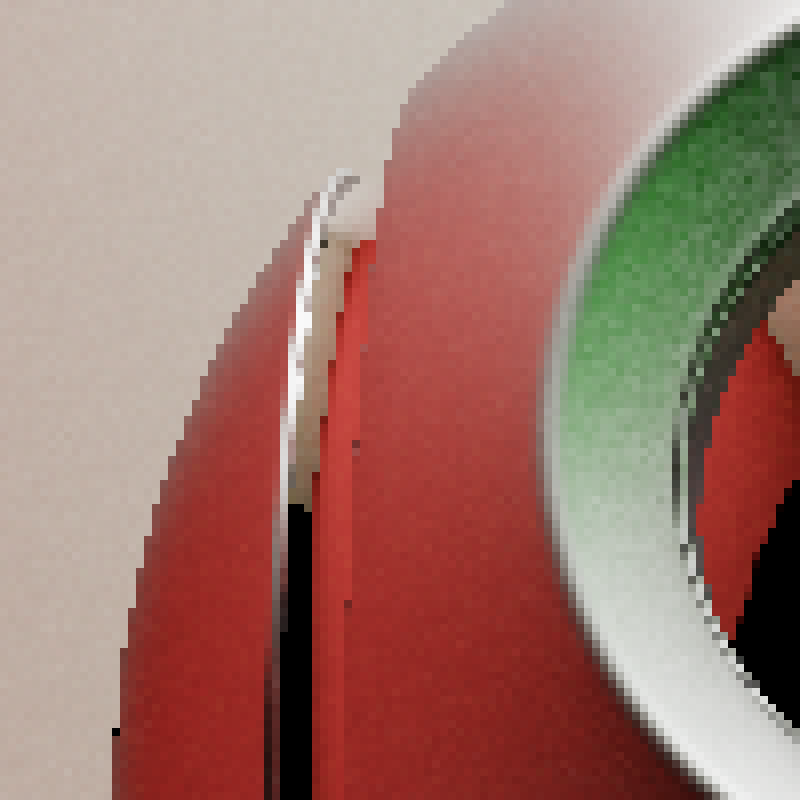 |

### Perfect Specular Reflective & Refractive Material

#### Implementation

For the perfect specular reflective material, this is quite simple, just use glm::reflect to reflect the ray, and times the throughput with material's color.

For the perfect specular refractive material, that's a little bit more complex then reflect, since you have to make it clear what's the ray's direction, to the point or out the point (**BE CAREFUL when using glm::refract**) ? and what's the eta, ior or 1/ior? That will cost a lot of time to debug, especially when the ray sphere intersection code suffers from floating point error, that makes you don't know whether the refractive part is wrong or the ray epsilon is too small.

#### Results

Here we show two images of Perfect Specular Reflective and Perfect Refractive materials，with different ior.

|               Reflective               |       Refractive ior = 1.5        |         Refractive ior = 1.33          |
| :------------------------------------: | :-------------------------------: | :------------------------------------: |
| 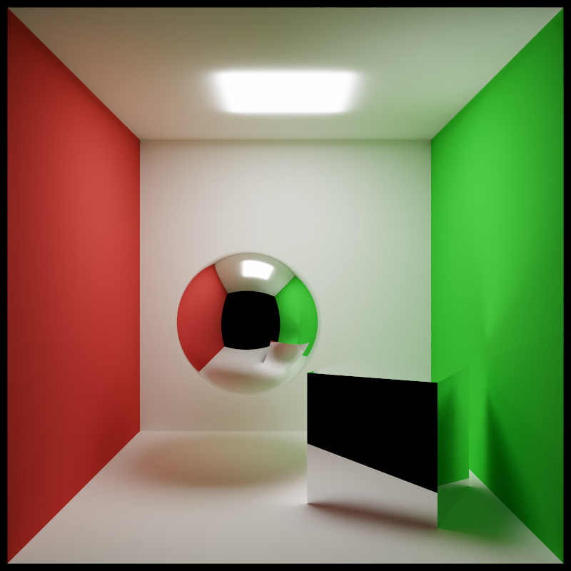 | 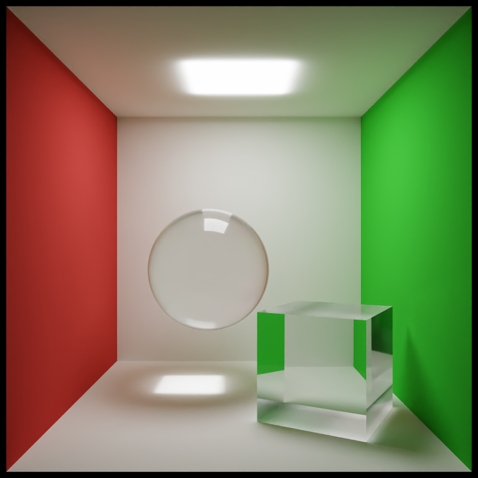 | 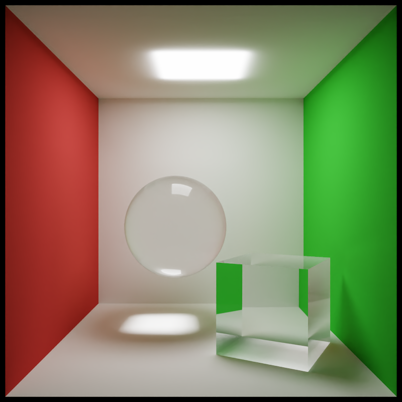 |

### Disney BSDF

#### Implementation(not completely)

For the Disney BSDF, it's a mixtures of multiple lobes, diffuse, dielectric refelction, metallic refelction, glass, and clearcoat. So to sample multiple different lobes, we have to randomly choose one and use it to evaluate the BSDF. For the evaluation part, we need to evaluate the contribute with each type of lobe using the current direction.

The Diffuse part of Disney BSDF has the most different with common PBR materials, because it is not using a lambert diffusion, instead use a model taken into account retro-reflection and fake subsurface scattering.

For dielectric, metal and glass parts, things are similar to common PBR materials because they are all using microfacet model and GGX (GTR2 is GGX) normal distribution function. Note that complete Disney BSDF contains anisotropic and sheen parameters, which are not implemented here due to time limit.

For clearcoat part, it is a completely different lobe, similar to dieletric but uses GTR1 normal distribution function to create a longer tail.

#### Results

I build the scene with a environment map and 25 different UE material balls, they all have a pure reflective inner layer, and the outer layer is using different parameters of Disney BSDF. From the bottom row to top row, we are comparing Roughness, Metallic, Transmission, Clearcoat and Subsurface. In each row those values goes from 0 to 1.

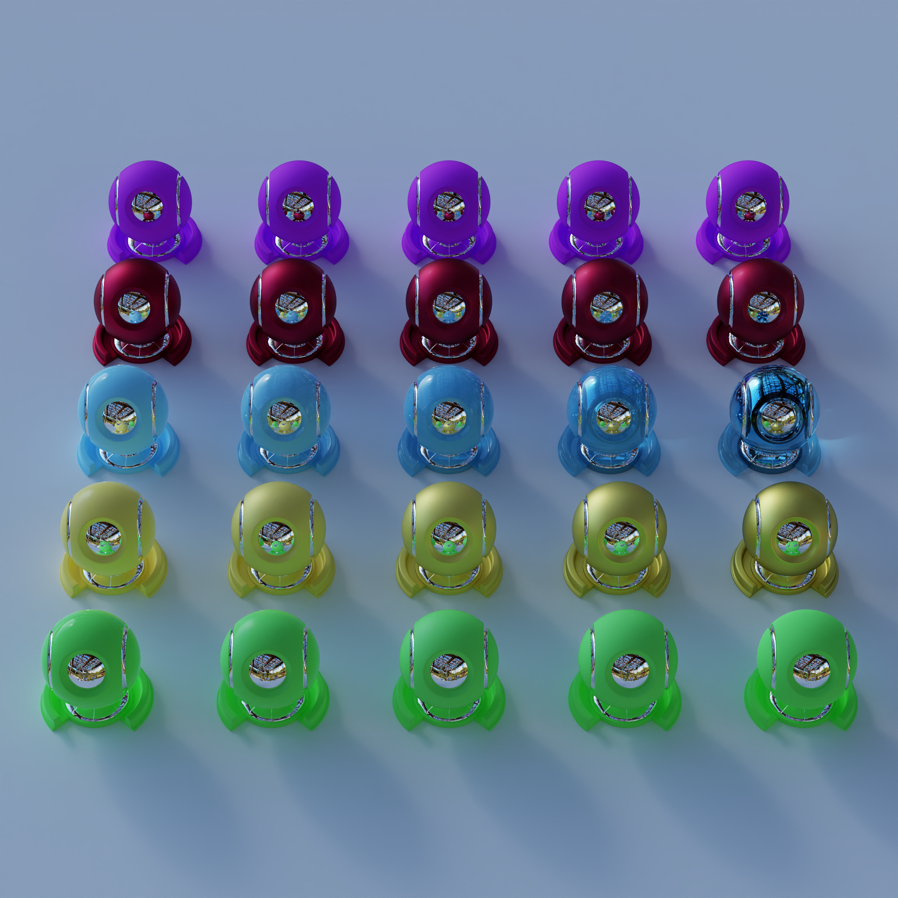

### Texture Mapping & Normal Mapping

#### Implementation

To implement this, we have to first create a new data structure, Texture. A texture on the CPU is easy to load, just use stb_image or tiny_gltf loading, then you can copy the data to the array you want to use. But for CUDA, we have to send the texture to GPU, which is more complex than OpenGL which can also send textures to GPU side.

We have to firstly have to use `cudaMallocArray` (or `cudaMallocMipmappedArray` for mipmap textures). Then to create a cuda texture, should call `cudaCreateTextureObject` function with two resource description parameter, `cudaResourceDesc` and `cudaTextureDesc`, these steps are more like those steps in OpenGL texture creating.

But for mipmap textures, CUDA will not generate mipmaps for you automatically like OpenGL does, so we have to write a kernel to downsample the texture ourselves, and `cudaMemcpy` those data to the right address manually. That's very inconvenient I think.

Finally to use textures on the GPU, we need the handle `cudaCreateTextureObject` returned to us, we can saved this in another array and copy to GPU side when `pathTraceInit`.

Another important part to implement texture mapping and normal mapping is the texture coordinates. In my implementation, I read two set of texcoords for each glTF model, since some models choose to use different UVs to sample different textures. And after the intersection, we use the barycentric parameters to interpolate the texcoords, just like how we interpolate normals. For normal mapping, we still have to compute tangents in order to create the TBN space to map tangent space normal stored in normal texture into world space.

In my final implementation, Color, Metallic, Roughness, Normal, Emission and Transmission supports texture/normal maps.

#### Results

Results? see the header image, that could not be rendered without texture maps.

### Multiple Importance Sampling

#### Implementation

To implement this, I firstly change the structure of lights: lights are no longer mixed with meshes, also for the material of light, they are completely another kind of objects in the scene. After that, in the shading stage, instead of only checking whether this ray hit the light, we find lights in the scene and compute its contribution actively, and a shadow ray is casted to check whether the point can receive the energy from that light.

After completing that, we are not completely set with MIS, since we only check the contribution of lights now. some materials like perfect specular materials and materials with very small roughness is hard or even unable to sample by light. So we have to combine sampling the BSDF (that's what we did originally) and sampling the light. The amount of those two types of contribution are evaluated by their pdf, since a large pdf means it is more likely that this sampling method will give us a better result than another. So we use power heuristic here to compute the portion of two types of sampling results and add both. In that case our renderer can handle different types materials.

#### Results

MIS can create better images with same samples, or create image of same quality with less samples. At here we can compare the results of enabling and diabling the MIS with all 500 samples.

|                       With MIS                       |                        W/O MIS                         |
| :--------------------------------------------------: | :----------------------------------------------------: |
|  | 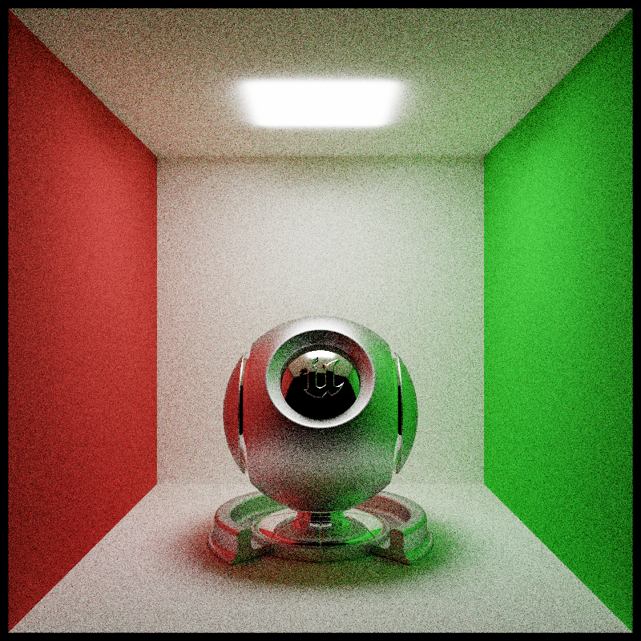 |

And there's also a very classic scene to show the function of MIS: veach scene. So we also include that:

|                 With MIS                 |                  W/O MIS                   |
| :--------------------------------------: | :----------------------------------------: |
| 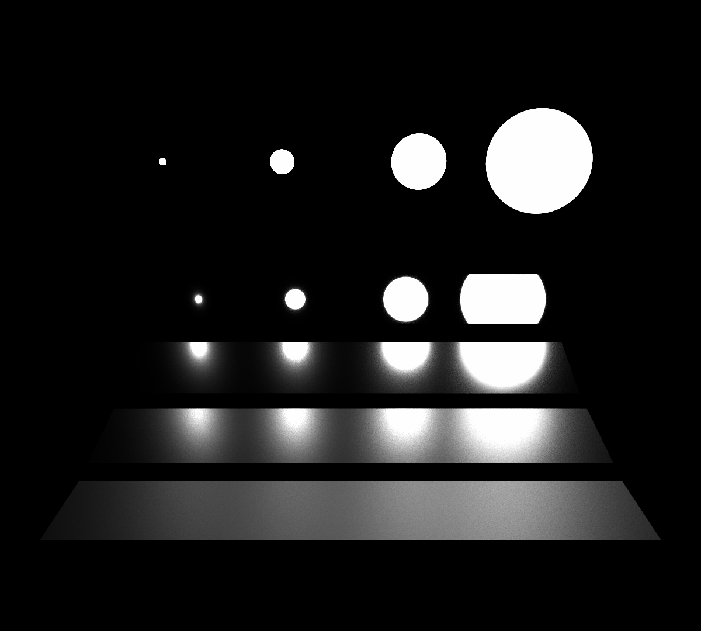 | 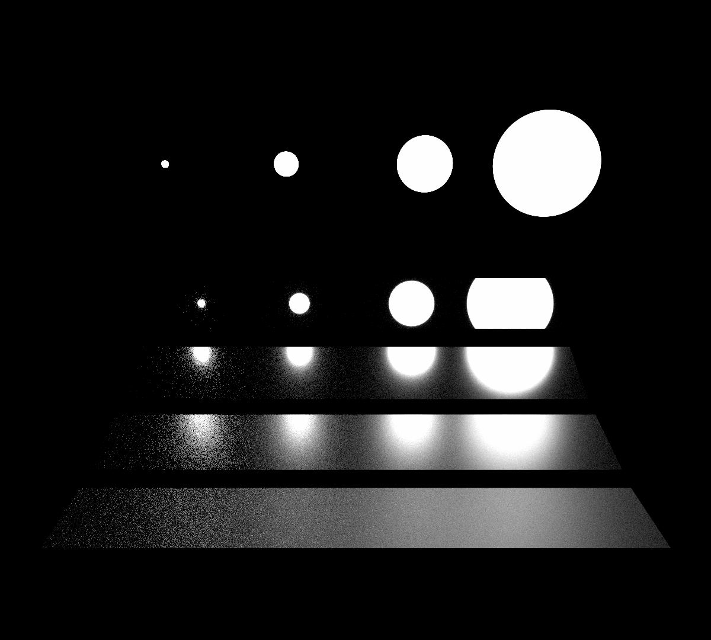 |

We can see that BSDF importance sample (originally) is not good at handling rough surface with small lights. (And pure light sample is not good at handlING specular surface with large lights, I didn't implement a pure NEE integrator so no image for that). But MIS sample can handle all kinds of materials with all kinds of lights.

### Depth of Field with Auto Focus

#### Implementation

To create physically based DoF, we have to add two parameters to the camera, focal distance and len's radius. Focal Distance is determing where's the clear plane, all the objects on the plane will be clear and all objects away from that plane will be blurer. Len's radius is controlling the strength of blur, a bigger len radius means light can comes from a larger range of angles, so the image will be blurer.

In my implementation, we first check the clear point of each ray on the clear plane, and then randomly sample a point on the len, finally use that ray as the final ray we shoot to the scene.

I also support Auto Focus, you can left-shift and click the scene, at the focal distance will be set to the surface you click. That's implemented by reading back the GBuffer of world position (or linear depth) and computing the focal distance.

#### Results

Here are the results of enabling and Disabling DoF.

|                 With DoF                  |                      W/O DoF                      |
| :---------------------------------------: | :-----------------------------------------------: |
| 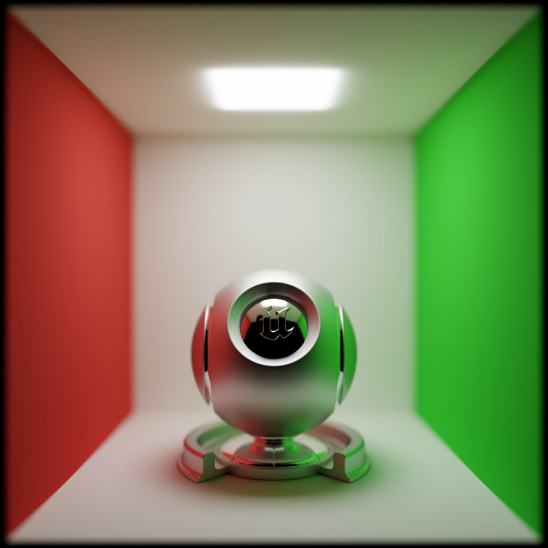 |  |

### Post Processing

#### Implementation

In my implementation, I include several types of post processing, they are View Transform (also called tone curve), White Balance (controlled by two params: temperature and tint), Saturation, Vibrance (this will only increase the saturation with low saturation part of the image), and Contrast. all post processing are in the linear space before mapping them to sRGB values.

#### Results

Here are the results of different View Transforms (Curves):

|                   No Curve                    |                 ACES Curve                 |                Reinhard-L Curve                |
| :-------------------------------------------: | :----------------------------------------: | :--------------------------------------------: |
| 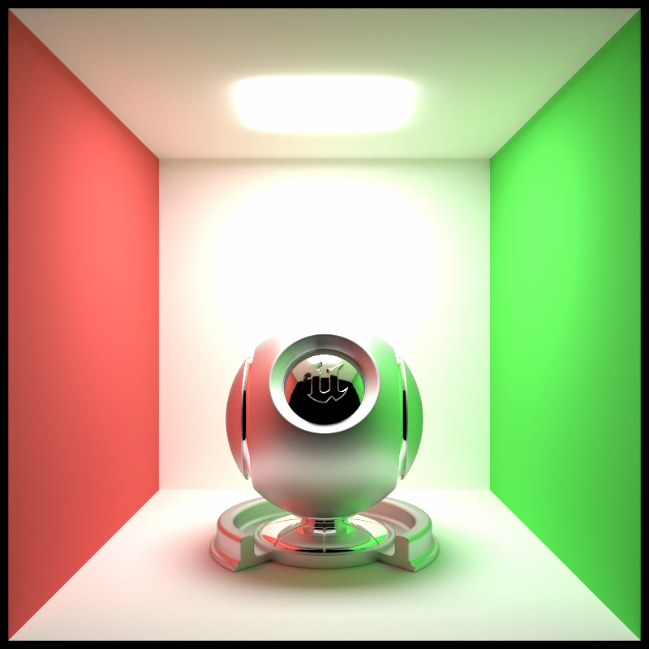 | 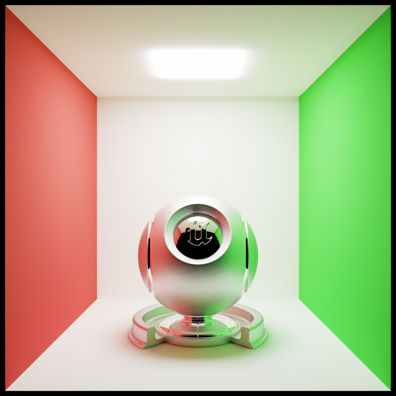 | 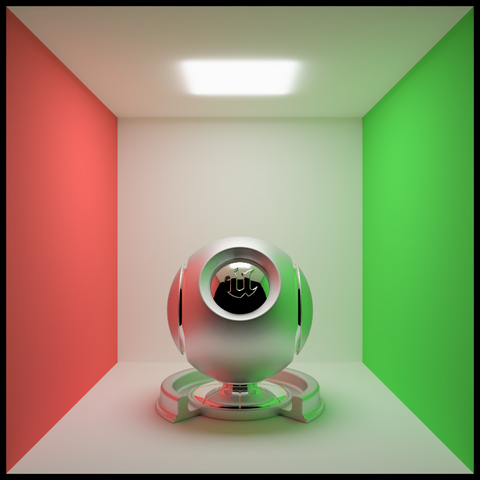 |

We can see that image with no curve applied has _over exposed_ when the energy is greater than 1, since this does nothing to handle HDR colors to SDR and just clamp then from 0 to 1. Reinhard-L curve, just the opposite, make the scene too plain, that's because it's curve is just doing `c/(1+c)` which makes high-energy pixels almost be the same color. And ACES curve is keeping the image not _over exposed_ and keeping the high-energy pixels _light_ view at the same time.

Here are some examples of different post-processing params with ACES curve:

|                 Exposure -1.0                  |                 Temperature -1.0                  |                  Saturation 0.3                  |                  Contrast 0.3                  |
| :--------------------------------------------: | :-----------------------------------------------: | :----------------------------------------------: | :--------------------------------------------: |
| 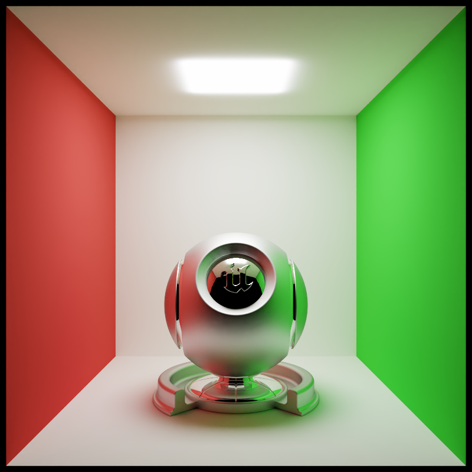 | 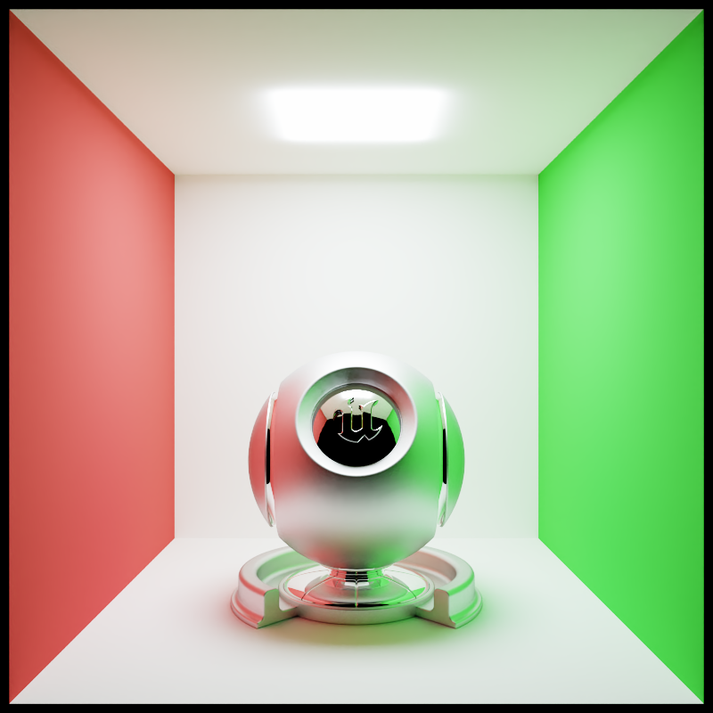 | 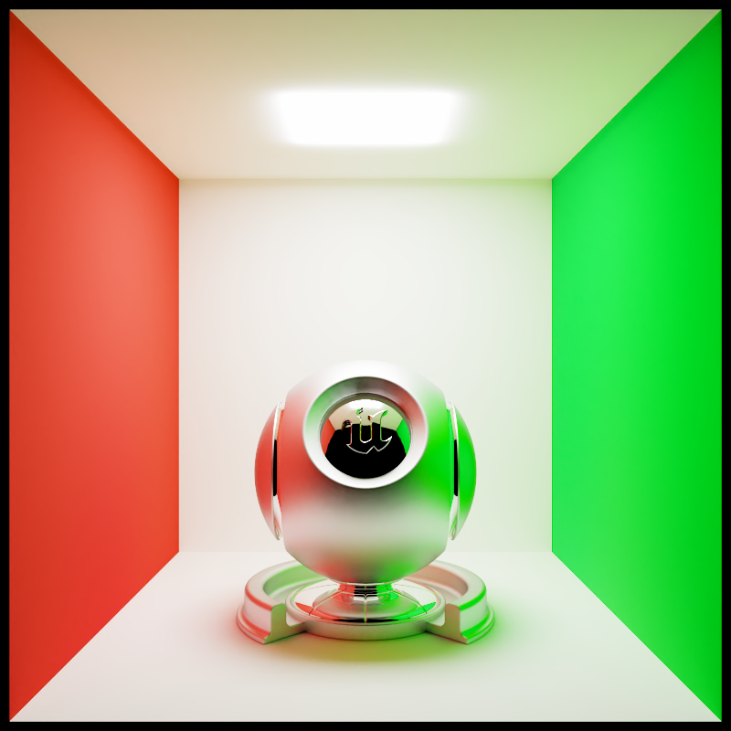 | 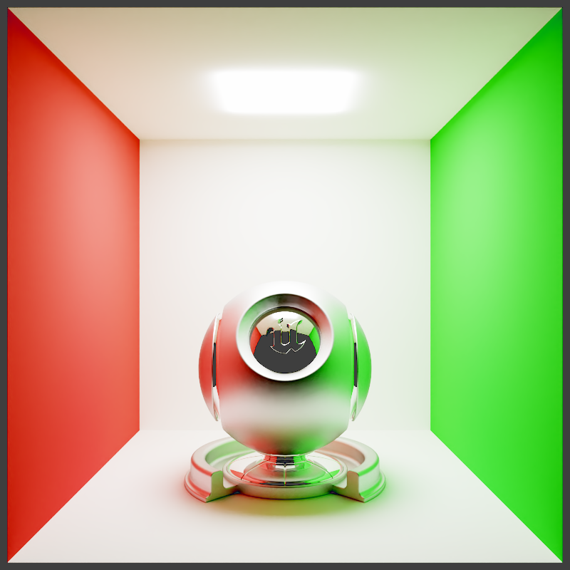 |

### Environment Mapping

#### Implementation

For environment mapping, we load .hdr files and send it to GPU also using CUDA textures introduced above. To use the environment map is easy, at here I only replace the color when hit nothing with the color sampled from environment map.

#### Results

|         With Environment Map         |          W/O Environment Map           |
| :----------------------------------: | :------------------------------------: |
| 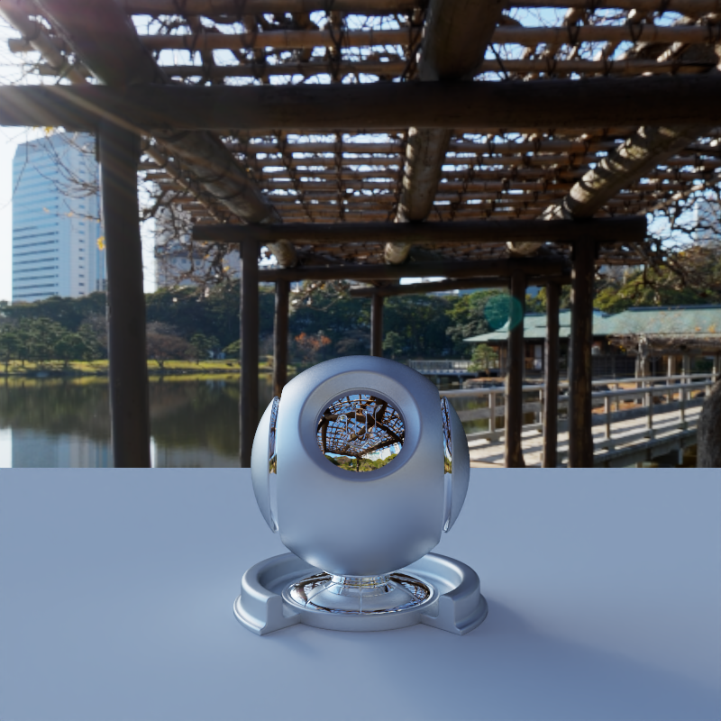 |  |

You asked me why there's a black picture? Of course because we have no lights nor env map!

#### Possible Future Work

Can try to treat the environment map as a light source, and importance sampling it. Easily we can apply cosine weighted sampling, and more advanced we can precompute the energy of each part of the environment map and importance sample it by that.

### Open Image AI Denoiser

#### Implementation

In my implementation, I create another buffer for denoised images to go, since I tried using only 1 buffer and re-write the denoised image to the buffer, which gives a really bad result. And I also use a `#if` to control whether enable realtime denoise or not, if so I will set the quailty to `OIDN_QUALITY_FAST` and denoise each frame, otherwise I set it to `OIDN_QUALITY_HIGH` and only denoise when the whole rendering process is finished.

#### Results

Images with denoise can use very less samples to get the visual effect of those with high samples, here are the results of images with 100/500 samples and with/without denoise.

|             |                   With Denoise                    |                     W/O Denoise                     |
| :---------: | :-----------------------------------------------: | :-------------------------------------------------: |
| 100 samples | 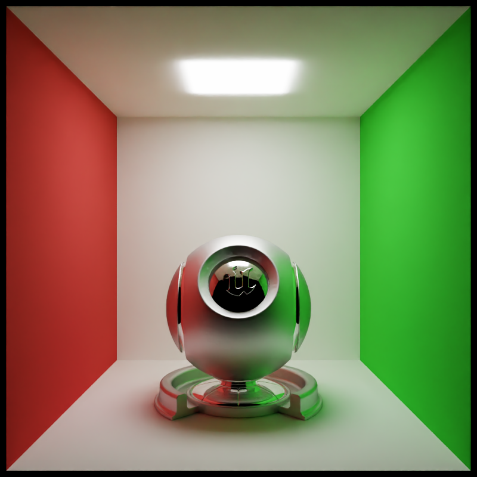 | 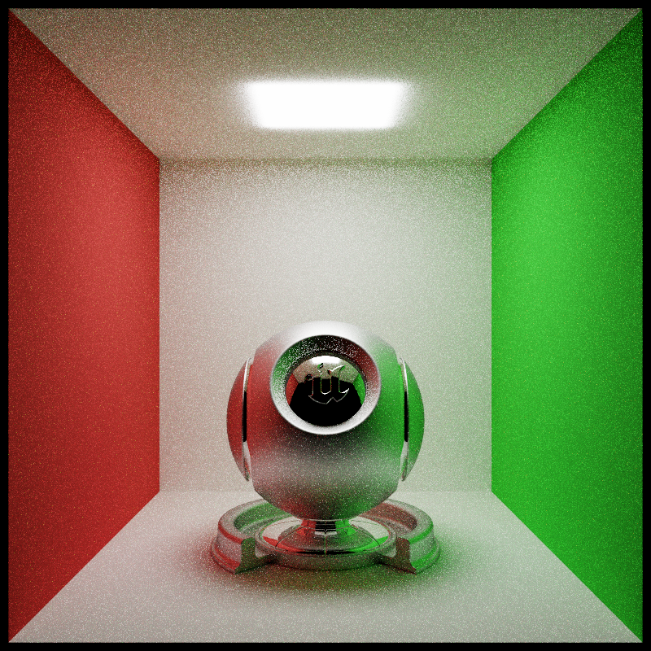 |
| 500 samples |  |  |

### Stylized Rendering - Cel-Shading

#### Implementation

For Cel-Shading, my implementation is quite easy - **REMOVE the COSINE ANGLE** for diffuse part, after that, as long as the the light is in front of the face, it will give the same amount of energy to them. I also add a angle clamp to make only the light&normal angle is smaller than some value then the light will count, since this can avoid some light shoot and hit itself at very grazing angles (in the original diffuse, cosine angle does this automatically).

And after that, we should also change our BSDF importance sampling method from cosine-weighted sampling to uniform cone sampling to match the new BRDF.

#### Results

We can see the results that the light/dark boundry is sharpened after implementing this:

|         With Cel-Shading          |           W/O Cel-Shading            |
| :-------------------------------: | :----------------------------------: |
|  | 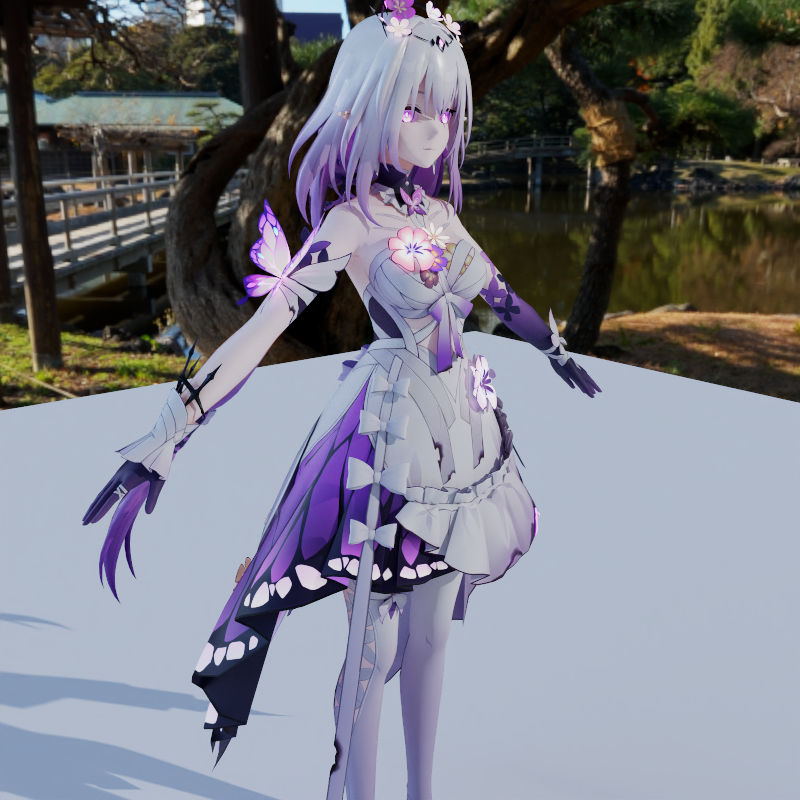 |

Look at characters' nose, left arm and legs, those are the places most obvious.

### Stylized Rendering - Shadow Channel

#### Implementation

The shadow channel is used to ignore some shadow, which is very useful on characters' faces, because it can ignore the shadows of the noses and lips, make the faces clean. To achieve that, I wrote per-vertex data in Blender called `_SCHANNEL`, and read it from glTF exported to each vertices' `schannel`. In the intersection (both closest hit and any hit in directLight) stage, I check the ray's origin's `schannel` and the hit point's `schannel`, if they meet some requirements, then ignore this hit. And after each valid hit, I update the segment's `schannel` to the hit `schannel` for checking the next intersection.

Currently the schannel _requirements_ are wrote fixed into the code, this will be better to load from .json files but time limits.

#### Results

The results are obvious, we can see some shadows on the faces are ignored:

|            With Shadow Channel             |        W/O Shadow Channel         |
| :----------------------------------------: | :-------------------------------: |
| 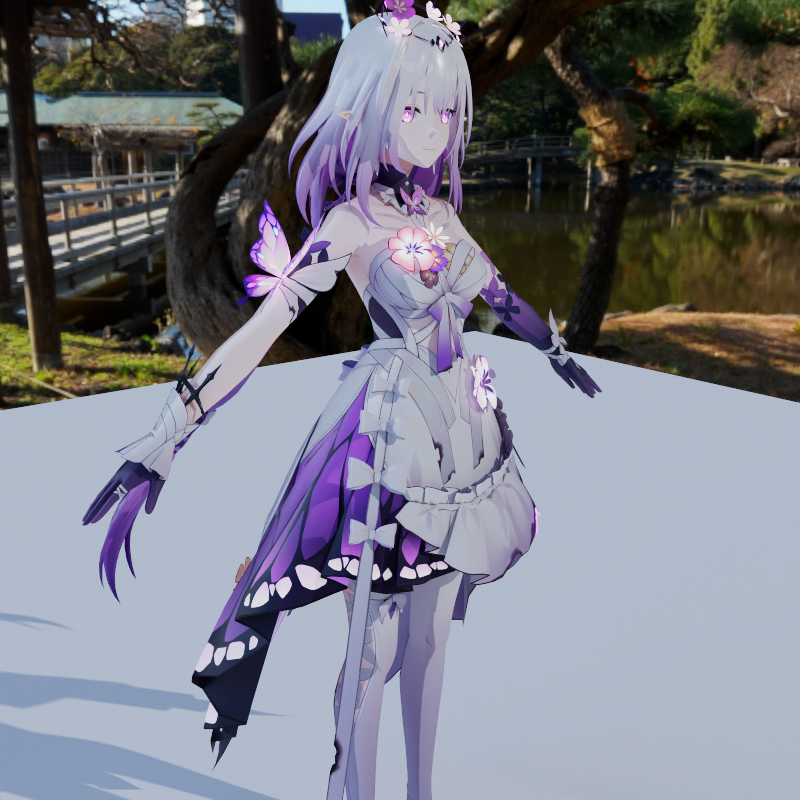 |  |

### Stylized Rendering - Line Rendering

#### Implementation

In my implementation of line rendering, I used back-facing methods to find edges. That's render an additional pass after GBuffer which cull's all front faces, and moves all vertices along the normal a little bit. To make the line always the same width, the shift is multiplied with linear depth from the camera.  
Note that very importantly, we have to use another BVH which includes extended vertices to intersect with when using vertex shift, since the original BVH will cause us not intersect with some part.  
After finding the edges, I treat them as light sources and find intersections in screen space in the real path-tracing stage, if hit then use that color as light color and terminate the ray.  
To write the line color in glTF, I use Blender's export option to include them in material properties, so they can be read and load to use.

#### Results

We can see the results of line rendering very clearly, there are lines around the character's edges:

|          With Line Rendering           |             W/O Line Rendering             |
| :------------------------------------: | :----------------------------------------: |
| 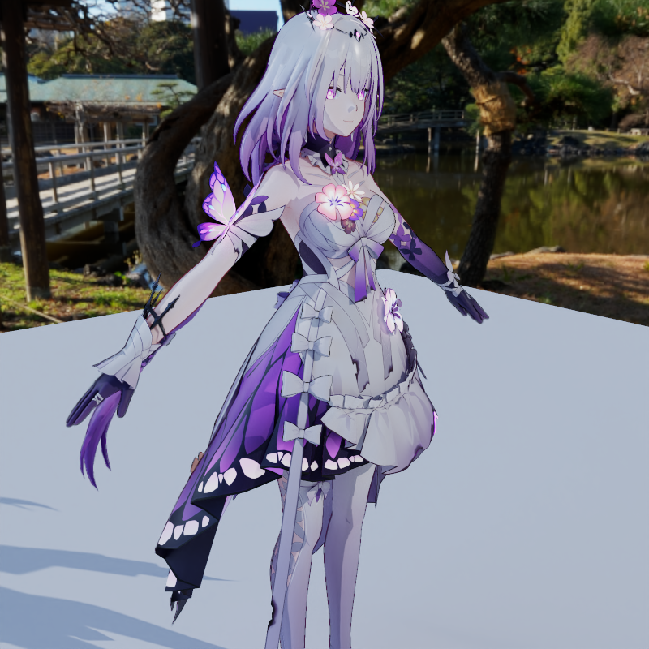 |  |

### Stylized Rendering - Future Work

Stylized Rendering still has many things to do. Easier things can be image layers, which enables us to render character's eyebrow and eyelash in front of their bangs, which is very common in anime games like Genshin, HSR and Wuwa. And some other features like anisotropic hair specular light (I don't know whether Disney BSDF's anisotropic param can do this, if so then I will say it's my loss to skip the implementation of this) and color ramp can be introduced.

Then my implementation of line rendering has some limits since it is finding intersections in screen space, which is means some intersections cannot be found especially with DOF, and I did't taken lines after 1 bounce into account which means lines in reflections are not rendered. To do more about this, there is a paper by Rex West: http://cv.rexwe.st/pdf/pbflr.pdf. (In fact I tried some of his thoughts like detecting edges within a cone of rays and treating found edges as light sources, but my implementation is too poor makes the detected lines quality very low, so I turned to back-facing methods later)

And the most difficult part, is to taken the whole stylized shading as a whole part and tried to maintain energy conserving about it, (now I'm doing all about tricks and those tricks will cause energy not conserving). To do more about this, there's also a paper by Rex West: http://cv.rexwe.st/pdf/srfoe.pdf

## Performance Features

### Ray Compaction

#### Implementation

For the ray compaction, I use my compaction implementation. I use that fuction from hw02 to create a new function called partitionStable, which is very similar to radix sort but only the last digit. I saved whether this ray is going to terminate in another buffer, and use it as key to compaction to get the index, and then use another kernel to write segments into their new places.

#### Performance

We test the performance in two scenes, Open Scene with a sphere and a environment map, Closed Scene with a cornell box. We can see the performance gain of compaction here:

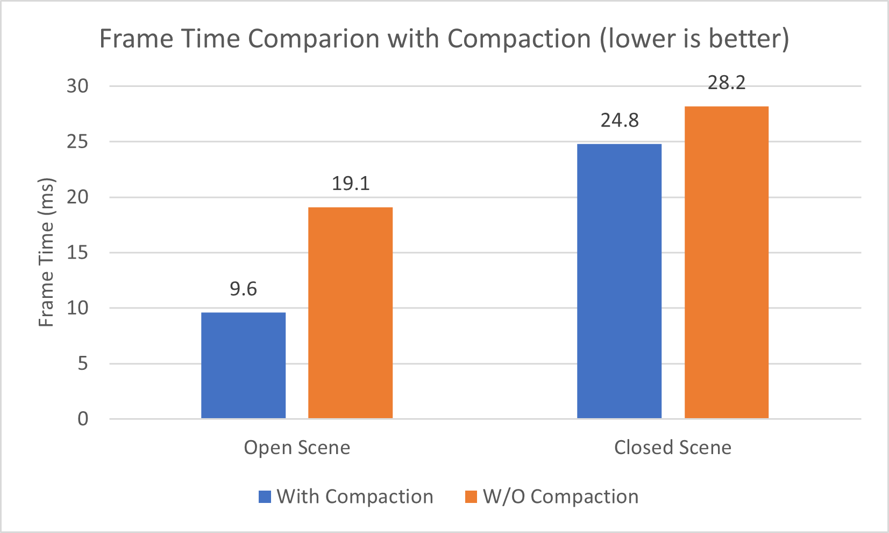

We can see that in the open scene, compaction gives much more performance gain (almost 100%), why is that? Let's think about how compaction handle the segments: it only removes the **terminated** ray segments. That means the more rays are terminated, the more performance gain it can give us, vice versa. So let's look at how many ray segments are still alive after bounces in each scene, and we will know the answer.

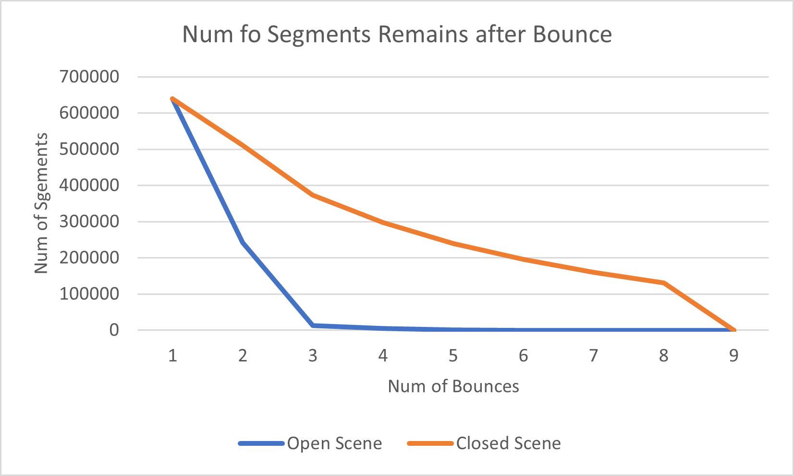

In the open scene, number of segments decreases quickly, and that gives compaction huge space to accelerate the process by removing the terminated rays and launching less threads next time.

### Material Sort

#### Implementation

For the material sort implementation, I used `cub::DeviceRadixSort::SortKeys` (thrust also use this for radix sort), because I found my implementation cost too much time on transfering data between buffers. In my implementation, if material sort is enabled, then I will write a "mattype" key into a buffer and use it to sort. Additionally, if material sort is enabled I will predicate whether the ray is going to be terminate earliear (when hit nothing or light) and move them to the back at this stage before shading, so the compaction is automatically completed without more memory load/store cost.

#### Performance

We used three different scene to test the performance of material sort. All of the three have at least 2 different types of material (otherwise it will be obviously useless). The Basic Cornell scene is a cornell box with a sphere primitive which has 61 primitives in total. The Cornell with Blender Sphere is a larger scene with replace the sphere with blender UV sphere so it has 970 primitives in total. And the last scene we use cornell box with UE material ball we have 58600 primitives intotal which is the largest scene of the three.

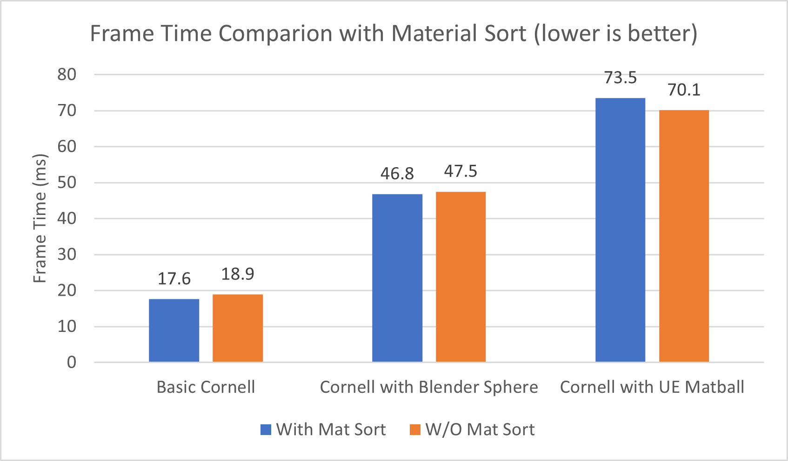

We can see that material sort will give performance gain in small scenes, where shading materials' time takes up quite a lot in the total time, the time it spend on shading covers the cost of sorting. But for the large scene, intersect ray with triangles is the most costly part, and this part will not be boosted by material sort at all, so there will be negative impact on performance.

### Russian Roulette

#### Implementation

I judge the probability of each ray segment by the biggest number of 3 channels of their current `thoughput`, and that reflects how much the future trace is able to contribute to the final color. So the final probabilty of my implementation is `min(max(throughput.r, max(throughput.g, throughput.b)) + 0.001f, 0.95f)`. after getting the probability `q`, generate a random number and compare to this `q`, if it's lower than we keep they ray and devide the `thoughput` by `q`, otherwise we terminate this ray.

Commonly russian roulette is put after the shading part. But according to my material sort implementation I'm checking whether rays are to terminate earlier, so if that's enabled, the russian roulette probability `q` will be judged before shading in the intersection function, and tag rays to terminate with `NONE_MAT` mattype to move them to the back. And to preserve energy, in the color devision we have to use `q` judged by the color before shading, not after it.

#### Performance

Here we can see the performance gain of russian roulette in different types of scene. For the open scene we choose UE material ball with a environment map which has 58552 triangles. And for the closed scene we choose UE material ball in cornell box which has 58600 triangles.

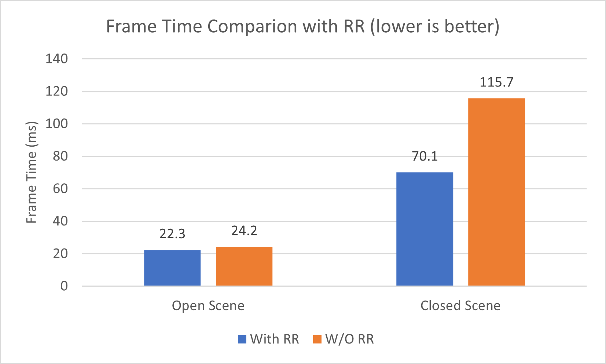

We can figure out that russian roulette improves performance in all scenes, but it can give more performance gain in closed scene, because without russian roulette, these rays will never hit "nothing" and will always tracing in the scene, which cost a lot of performance.

### Bounding Volume Hierarchies

#### Implementation

For the BVH implementation, I look at PBRT's chapter 7.3.

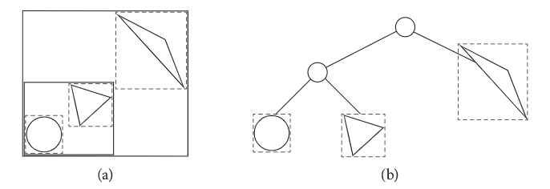

Firstly collect all the primitives in the scene, then compute the AABB of them, and then use a recursive progress on CPU to devide the AABB on the maximum extent to 2 children and work on those 2 children. In my implementation, I always use max primitives num in one leaf node is 1, since I don't want to do a more complex indexing when get intersections (But Note that this will not always be better, I just do so for convenience and time limit).

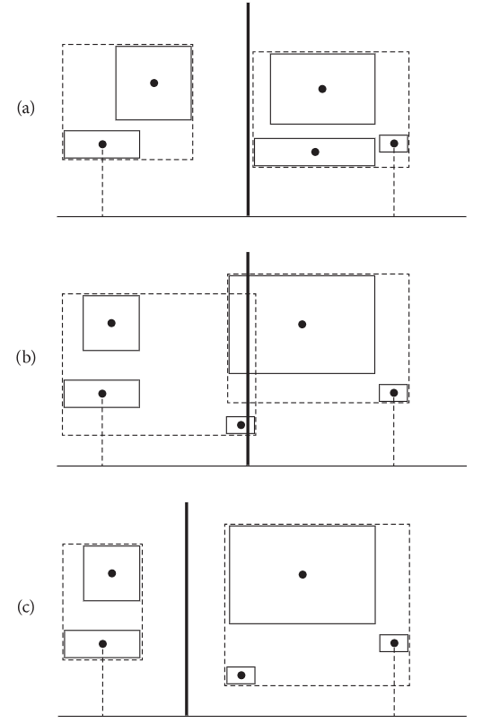

For the partition method, there are 3, equal-count, equal-size, and surface area heuristic. Some times equal size/count works well like a) in the picture, but sometimes they don't, like b). So we have some better method to evaluate a _intersection cost_ after each element in the node and choose the better partition, that's the SAH(surface area heuristic). In real implementation, to lower the building time, we cannot checking the cost of partition after each primitive, that's too slow, so instead we make 10-12 _buckets_, and put primitives sequentially into buckets based on their x/y/z(based on the axis to divide with)axis value, then we only check the partition cost after each bucket.

Since BVH is a tree-like structure, it's not memory-contigent to do intersection directly on GPU directly, and the pointers to children nodes will not work after transfering data from CPU to GPU, so we have to flatten the BVH into a 1D array. In the Linear BVH node structure, we will only record the second child's index, and the first child is always just behind the parent.

To traverse BVH node in GPU, we have to use an iterative method instead of a recursive method, so we have to use a stack to record nodes index when we go deeper, so we can get back after traversing all children and pop up them. To tag the tree is fully traversed, we push a -1 at the bottom of the stack, so if we pop something and that's -1, we are end with the traversal.

#### Performance

BVH is really really really important for path tracer if you want to render scenes with lots of triangles. Why? Look at the huge difference between with and w/o BVH. We use a cornell box and a geometry exported by Blender, and then use Blender's catmull-clark subdivision to increase the number of triangles:

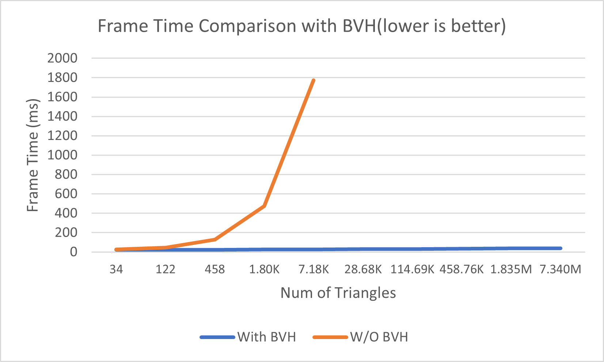

That even makes the chart hard to read! So we have to put the data into 2 charts so you can see the number.

|             With BVH              |              W/O BVH              |
| :-------------------------------: | :-------------------------------: |
| 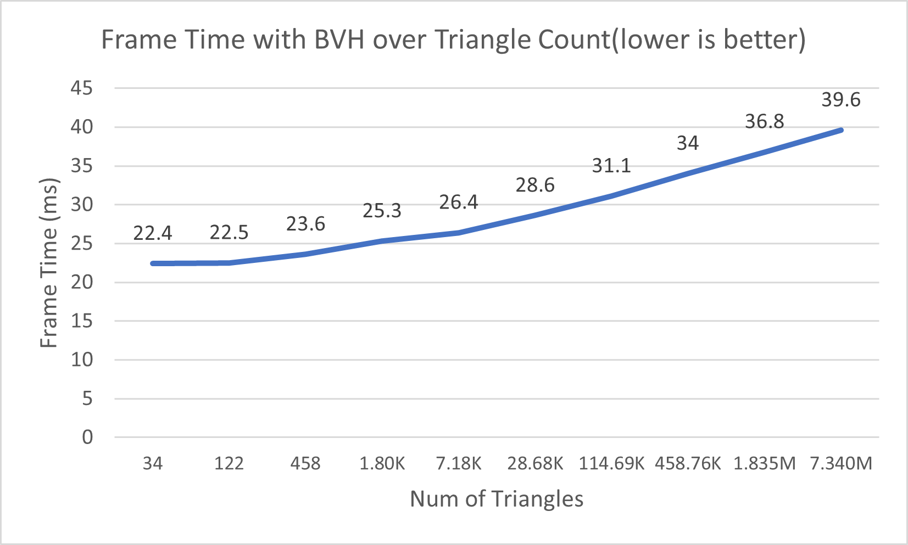 | 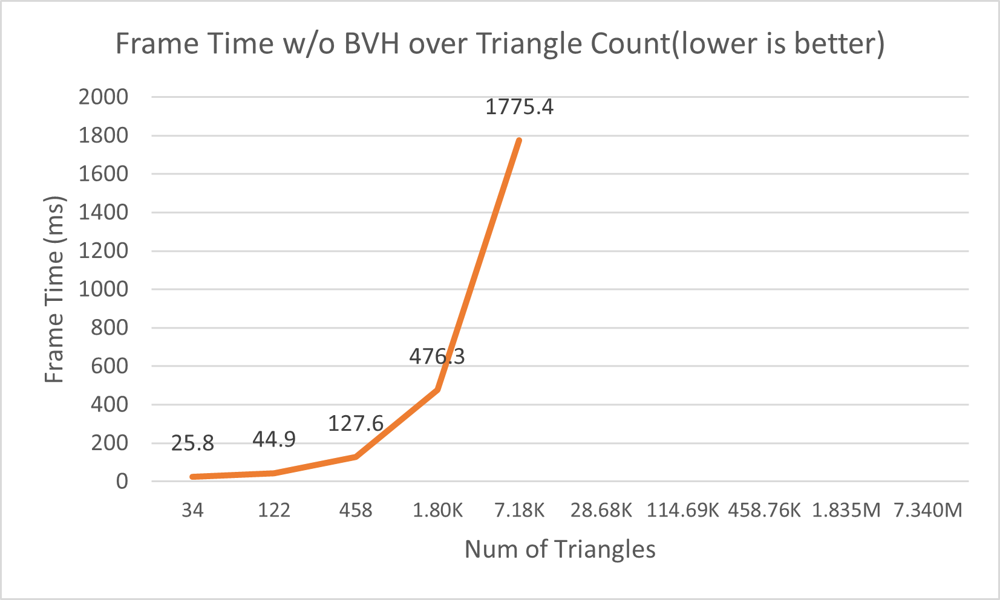 |

VERY crazy performance increase, when the num of triangles increases exponentially, frame time w/o BVH also increases exponentially, but with BVH the frame time just goes linerly. That matches our observation about the structure: the length of the array is O(N), while the depth of the tree is only O(logN).

#### Possible Future Work

Actually, in this implementation I only implemented one level BVH, while most renders have two level BVH, BLAS and TLAS. I tried to implement them but time does not permit. How much performance that two level structures will give is hard to know, because we cannot know the gain of memory contingency and the cost of tree strcuture degeneration, which one is larger. But this can REALLY save your GPU memory, since all same mesh instances in the scene will go to the same BLAS so you don't need to put all triangles really into the scene's vertex buffer, while in my implementation I have to instanciate all meshs with their transforms and really put them into the scene. This cost about 1.343GB only for BVH for a 12.8M triangles scene, which means if the scene goes larger, then it's not able to render on a RTX 4060 with 8GB memory😭.

## Compilation Changes

-   Add OIDN and tiny-glTF libraries.
    -   Add headers to ./external/include, static libraries to ./external/lib, and dynamic libraries to ./external/bin
-   **NOTE: CMake file edited for libraries and new src files.**

## Bloopers

Here are some very common error I think many of us have encountered:
  
This one is is because the default ray-sphere intersection function suffers from floating point error, So the rays generated are always hitting the same surface.

To validate the reason, I have another image like this:  
  
I have set the ior of the glass ball to 1.0 in this image, so idealy the ray will go through it without any changes, but you can see some stripes on the ball due to floating point error.

Another interesting blooper I encountered:  
  
A "sharp" sphere. That's because the barycentric coordinates is computed wrong (Yes, I don't use the glm's intersection function and it truely gives me lots of questions), so the normals computed using it is also wrong.

## References

### Tutorials

-   Bounding Volume Hierarchies, https://www.pbr-book.org/4ed/Primitives_and_Intersection_Acceleration/Bounding_Volume_Hierarchies
-   Disney BSDF, https://schuttejoe.github.io/post/disneybsdf/, https://cseweb.ucsd.edu/~tzli/cse272/wi2023/homework1.pdf
-   CUDA Textures, https://docs.nvidia.com/cuda/cuda-runtime-api/group__CUDART__TEXTURE__OBJECT.html
-   ACES Curve, https://knarkowicz.wordpress.com/2016/01/06/aces-filmic-tone-mapping-curve/
-   Blender glTF 2.0 export, https://docs.blender.org/manual/en/latest/addons/import_export/scene_gltf2.html
-   Back-facing Line Render, https://x-wflo.github.io/2021/08/06/Cel-shading3/
-   Physically-based Feature Line Rendering, Rex West, ACM Transactions on Graphics (SIGGRAPH Asia 2021), http://cv.rexwe.st/pdf/pbflr.pdf

### Libraries

-   tinygltf, https://github.com/syoyo/tinygltf
-   Intel Open Image Denoise, https://github.com/RenderKit/oidn

### Models

Please note that following websites are not accessible outside China, so you may need a VPN to read them.

-   [HSR] Castorice, official model by miHoYo. https://www.aplaybox.com/details/model/Eb6vXivegiZM
-   The Sea of Flowers in Memory, created by Wis. https://www.aplaybox.com/details/model/TBXa17wZuBZY
