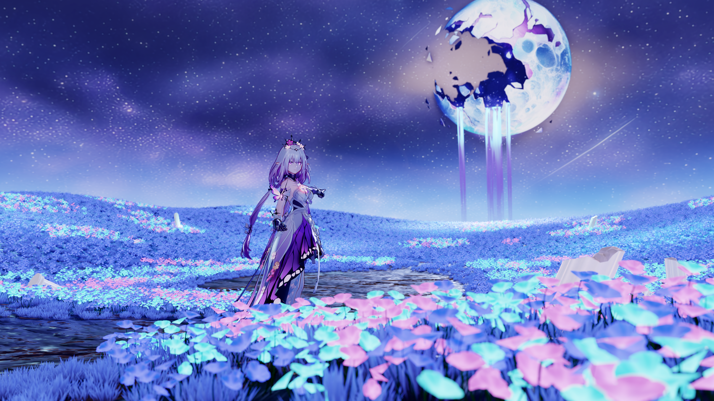
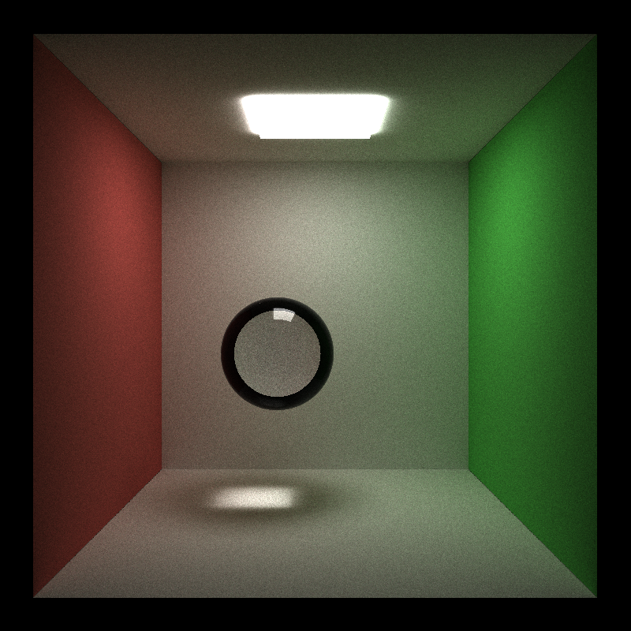
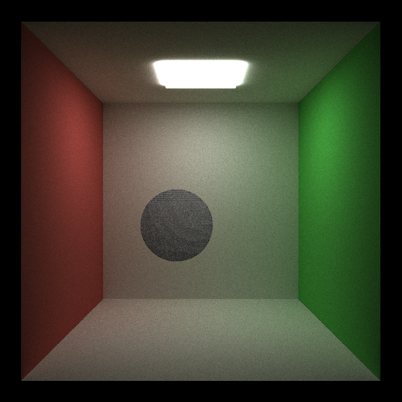
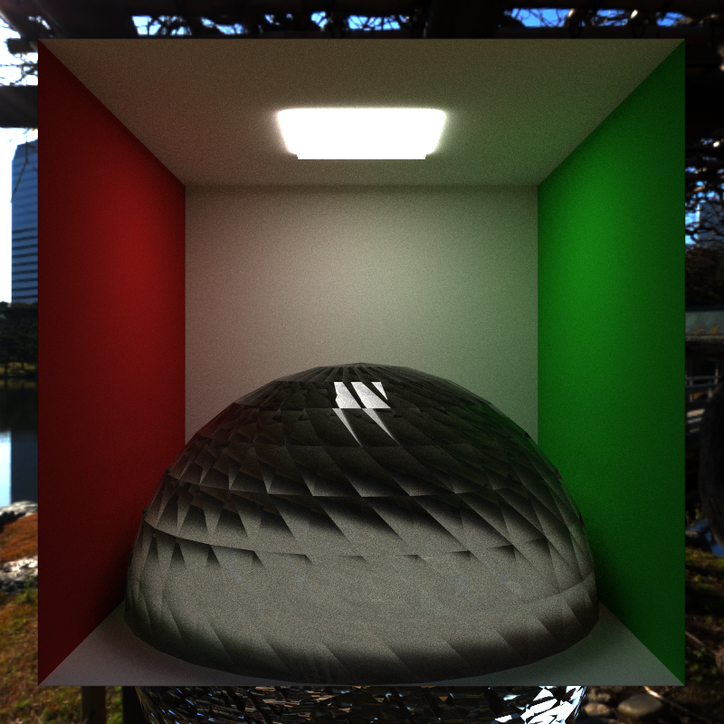

# CUDA Path Tracer

**University of Pennsylvania, CIS 565: GPU Programming and Architecture, Project 3**

-   Yu Jiang
    -   [LinkedIn](https://www.linkedin.com/in/yu-jiang-450815328/)
-   Tested on: Windows 11, Ultra 7 155H @ 3.80 GHz, 32GB RAM, RTX 4060 8192MB (Personal Laptop)

### (TODO: Your README)

_DO NOT_ leave the README to the last minute! It is a crucial part of the
project, and we will not be able to grade you without a good README.

## Compilation Changes

-   Add OIDN and tiny-glTF libraries.
    -   Add headers to ./external/include, static libraries to ./external/lib, and dynamic libraries to ./external/bin
-   **NOTE: CMake file edited for libraries and new src files.**

## Bloopers

Here are some very common error I think many of us have encountered:
  
This one is is because the default ray-sphere intersection function suffers from floating point error, So the rays generated are always hitting the same surface.

To validate the reason, I have another image like this:  
  
I have set the ior of the glass ball to 1.0 in this image, so idealy the ray will go through it without any changes, but you can see some stripes on the ball due to floating point error.

Another interesting blooper I encountered:  
  
A "sharp" sphere. That's because the barycentric coordinates is computed wrong (Yes, I don't use the glm's intersection function and it truely gives me lots of questions), so the normals computed using it is also wrong.

## References

### Tutorials

-   Bounding Volume Hierarchies, https://www.pbr-book.org/4ed/Primitives_and_Intersection_Acceleration/Bounding_Volume_Hierarchies
-   Disney BSDF, https://schuttejoe.github.io/post/disneybsdf/
-   CUDA Textures, https://docs.nvidia.com/cuda/cuda-runtime-api/group__CUDART__TEXTURE__OBJECT.html
-   ACES Curve, https://knarkowicz.wordpress.com/2016/01/06/aces-filmic-tone-mapping-curve/
-   Back-facing Line Render, https://x-wflo.github.io/2021/08/06/Cel-shading3/
-   Blender glTF 2.0 export, https://docs.blender.org/manual/en/latest/addons/import_export/scene_gltf2.html

### Libraries

-   tinygltf, https://github.com/syoyo/tinygltf
-   Intel Open Image Denoise, https://github.com/RenderKit/oidn

### Models

Please note that following websites are not accessible outside China, so you may need a VPN to read them.

-   [HSR] Castorice, official model by miHoYo. https://www.aplaybox.com/details/model/Eb6vXivegiZM
-   The Flower Sea in Memory, created by Wis. https://www.aplaybox.com/details/model/TBXa17wZuBZY
